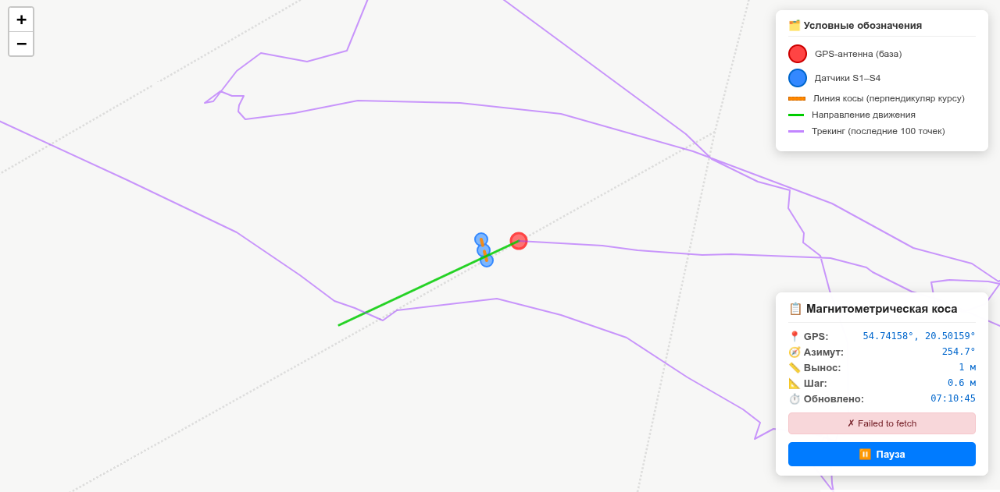

# 🛰️ SnifferCOM v5 — Универсальная магнитометрическая коса с геодезической привязкой

Система для синхронного сбора данных с **N-датчиковой сенсорной косы** (200 Гц) и **GPS+компас** (10 Гц) с геодезическим расчётом точных координат каждого датчика в реальном времени.



> ✅ Работает **полностью офлайн** после установки  
> ✅ Поддержка **произвольного количества датчиков** (1–254)  
> ✅ Прямая геодезическая задача на эллипсоиде WGS84  
> ✅ Автоматический расчёт магнитного склонения (модель WMM2025)  
> ✅ Веб-карта с автообновлением (CartoDB, масштаб до 1:500)

---

## 🚀 🚀 🚀 Быстрый старт

Использование (более подробно см. README.md далее):
###  Терминал 1 — сбор данных (пример для Windows)
```
python importercom.py --sensor-port COM4 --gps-port COM5 --num-sensors 4 --output field_data.jsonl
```

###  Терминал 1 — сбор данных (пример для Linux)
```
python importercom.py --sensor-port /dev/ttyUSB0 --gps-port /dev/ttyACM0 --num-sensors 4 --output field_data.jsonl
```

### Терминал 2 — сервер карты
```
python3 serve_map.py
```

### Открыть Браузер
Ввести `http://localhost:8000/map.html`

---

## 📦 Описание проекта

Система синхронного сбора данных с **N-датчиковой магнитометрической косы** (200 Гц) и **GPS+компас** (10 Гц).

*   **Геометрия:** Коса вынесена вперёд на заданное расстояние, датчики расположены перпендикулярно курсу с заданным шагом (гибкая настройка).
*   **Расчёты:** Прямая геодезическая задача (эллипсоид WGS84) для координат каждого датчика + расчёт истинного азимута (магнитный + склонение WMM2025).
*   **Режим:** Пакетный (10 Гц), триггер от GPS. Данные сенсоров берутся по принципу «последнее доступное».
*   **Ориентация:** Используется **истинный азимут устройства** (`azimuth_true`), а не GPS-курс (`course_true`), так как на пешей скорости (2–4 км/ч) курс имеет высокий шум.

---

## 📂 Структура файлов

1.  `importercom.py` — Основной скрипт сбора и обработки (универсальный, N датчиков).
2.  `serve_map.py` — Локальный HTTP-сервер с CORS для раздачи карты.
3.  `map.html` — Веб-карта (Leaflet + CartoDB) с автообновлением и легендой.
4.  `requirements.txt` — Зависимости (`pyserial`, `geographiclib`, `pygeomag`).
5.  `WMM.COF` — Файл модели магнитного поля (обязателен для `pygeomag`).
6.  `README.md` — Документация.

---

## 🚀 Команды запуска (Linux / Windows PowerShell)

**Терминал 1: Сбор данных**
```bash
# Linux (4 датчика)
python3 importercom.py --sensor-port /dev/ttyUSB0 --gps-port /dev/ttyACM0 --num-sensors 4 --output field_data.jsonl

# Linux (8 датчиков, другой шаг)
python3 importercom.py --sensor-port /dev/ttyUSB0 --gps-port /dev/ttyACM0 --num-sensors 8 --spacing 0.25 --output field_data.jsonl

# Windows (4 датчика)
python importercom.py --sensor-port COM3 --gps-port COM4 --num-sensors 4 --output field_data.jsonl
```

**Терминал 2: Запуск карты**
```bash
python3 serve_map.py
# Откройте в браузере: http://localhost:8000/map.html
```

---

## 🔧 Ключевые особенности кода

1.  **Парсинг бинарного протокола:** 23-байтный кадр, little-endian `int32` для амплитуды/градиента (деление на 10 для нТл). **Поддержка любого количества датчиков** (ID от 1 до 254).
2.  **Буферизация сенсоров:** Класс `BinarySensorReader` использует поиск маркера `78 56 34 12` для восстановления синхронизации потока. Корректная обработка фрагментов и нескольких кадров в буфере.
3.  **Геодезия:** Функция `calculate_sensor_coords_geodetic` решает прямую задачу для каждой точки косы относительно GPS.
4.  **Навигационная конвенция:** Используется `atan2(-mag_y, mag_x)` для корректного расчёта азимута по часовой стрелке (стандарт NED).
5.  **Магнитное склонение:** Встроенная модель WMM2020 (офлайн, без интернета) через `pygeomag`. Требуется файл [`WMM.COF`](https://www.ncei.noaa.gov/products/world-magnetic-model) (разместить в корне проекта).
6.  **Карта:** Автоцентрирование можно отключить кнопкой «Пауза» для ручного зума. Отображает все датчики динамически.

---

## 📐 Алгоритм расчёта координат датчиков (4 шага)

В скрипте реализован классический геодезический подход. Вот что происходит «под капотом» для каждого пакета:

### 🔹 Шаг 1. Истинный азимут
```python
azimuth_true = azimuth_magnetic + declination_deg
```
*   `azimuth_magnetic` — угол магнитного севера относительно оси X компаса (из `atan2(-Y, X)`).
*   `declination_deg` — магнитное склонение для текущих координат (рассчитывается по модели WMM2025).
*   **Результат:** направление «носа» устройства в системе координат карты (0° = истинный север, по часовой стрелке).

### 🔹 Шаг 2. Расстояние до каждого датчика (Пифагор)
```python
dist = math.hypot(dx, dy)  # dx = forward_offset, dy = (i-1-center)*spacing
```
*   `dx` — смещение вперёд по оси носа устройства (одинаково для всех датчиков).
*   `dy` — смещение влево/вправо поперёк оси носа (симметрично относительно центра косы).
*   **Результат:** евклидово расстояние от точки GPS до центра каждого сенсора.

### 🔹 Шаг 3. Угловое смещение (пеленг) через арктангенс
```python
bearing_offset = math.degrees(math.atan2(dy, dx))
true_bearing = (azimuth_true + bearing_offset) % 360
```
*   `atan2(dy, dx)` автоматически возвращает угол со знаком в диапазоне (-180°; +180°] с учётом квадранта.
*   Сложение с `azimuth_true` поворачивает локальный угол датчика в глобальной системе координат.
*   **Результат:** истинный пеленг от точки GPS на каждый конкретный датчик.

### 🔹 Шаг 4. Прямая геодезическая задача (WGS84)
```python
from geographiclib.geodesic import Geodesic
GEOD = Geodesic.WGS84
res = GEOD.Direct(lat_gps, lon_gps, true_bearing, dist)
```
*   Алгоритм Karney (реализован в `geographiclib`) решает уравнение на эллипсоиде с точностью ~15 нанометров.
*   **Результат:** точные широта и долгота каждого датчика (`latitude`, `longitude`), готовые для записи в JSON.

---

## 📡 Обработка бинарных данных сенсоров и NMEA

### 🔹 1. Бинарный протокол сенсорной косы (23‑байтный кадр)

Каждый датчик (ID от 1 до 254) непрерывно выдаёт кадры фиксированной длины. Структура кадра:

| Смещение | Размер | Поле                | Тип       | Примечание                              |
|----------|--------|---------------------|-----------|----------------------------------------|
| 0        | 1      | Синхро              | uint8     | Всегда `0x00`                          |
| 1        | 1      | Индекс датчика      | uint8     | `0x00` (резерв)                        |
| 2        | 1      | **Адрес отправителя**   | uint8     | `0x01`..`0xFE` (ID датчика)            |
| 3        | 1      | Синхро              | uint8     | Всегда `0xFF`                          |
| 4–6      | 3      | Служебные           |           | модуль, команда, фильтр                |
| **7–10** | 4      | **Амплитуда**       | int32 LE  | нТл × 10 (делим на 10)                |
| **11–14**| 4      | **Градиент**        | int32 LE  | нТл/м × 10 (делим на 10)              |
| 15–16    | 2      | Длина               | uint16 LE | Не используется в расчётах             |
| 17–18    | 2      | CRC‑16             | uint16 LE | Не проверяется в текущей версии        |
| **19–22**| 4      | **Маркер**          | uint32 LE | Всегда `0x12345678` (в памяти `78 56 34 12`) |

**Алгоритм приёма (`BinarySensorReader`):**  
1. Байты накапливаются в буфере.
2. Ищется маркер `78 56 34 12` (последние 4 байта кадра).
3. От маркера отступается на 19 байт назад — это предполагаемое начало кадра.
4. Если длина = 23 байта и синхробайты (`0x00` и `0xFF`) на месте, кадр считается валидным.
5. Извлекаются `sensor_id`, `amplitude_nt`, `gradient_nt`; обновляется словарь `latest` для соответствующего сенсора.

**Важно:** Скрипт поддерживает **любое количество датчиков** (1–254). При инициализации создаётся словарь нужного размера.

---

### 🔹 2. Парсинг NMEA‑сообщений GPS+компас

Используются расширенные строки формата:  
`$GNRMC,...<магнитометр>`.  
Магнитометр отделён точкой с запятой: `$GNRMC,...;mx,my,mz` (поля после `;` — компоненты магнитного поля в условных единицах).

**Основные шаги парсинга:**
1. Разделение строки по `;` на NMEA‑часть и магнитометрическую часть.
2. NMEA‑часть разбирается как стандартное предложение `$GNRMC` (координаты в формате DDMM.MMMM, курс, скорость, время).
3. Магнитный азимут вычисляется по компонентам `mx, my`:  
   `azimuth_magnetic = atan2(-my, mx)` → угол от 0 до 360° (0° — ось X компаса, разъём сзади).
4. Истинный азимут: `azimuth_true = azimuth_magnetic + declination` (склонение из WMM).
5. GPS‑курс (`course_true`) берётся из NMEA как есть, но используется только для диагностики.

---

### 🔹 3. Совместная обработка (формирование JSON‑пакета)

**Принцип:** основным тактирующим сигналом служит GPS (10 Гц). При поступлении каждого валидного GPS‑предложения выполняется:
1. Из `BinarySensorReader.latest` читаются последние доступные данные всех сенсоров (для каждого ID от 1 до `num_sensors`).
2. По текущим координатам GPS и истинному азимуту `azimuth_true` вычисляются координаты каждого сенсора (прямая геодезическая задача).
3. Собирается итоговый JSON‑объект, включающий:
   - GPS‑часть (координаты антенны, азимут, склонение, курс),
   - массив `sensors` с координатами и показаниями (амплитуда, градиент),
   - метаданные (время, параметры геометрии).

**Важно:** данные сенсоров берутся **асинхронно** — используется самое свежее значение на момент прихода GPS. Это допустимо, потому что частота опроса сенсоров (200 Гц) значительно выше частоты GPS (10 Гц) и задержка не превышает 5 мс. Параметр `--max-sensor-age` (по умолчанию 100 мс) защищает от использования устаревших данных.

---

# 🚀 Развёртывание и работа с системой

---

## 🧭 Ориентация модуля компаса 

### ⚠️ Критически важно: где «нос» устройства?

Для модулей типа Beitian BN-880 действует стандарт:

> **«Нос» (положительное направление оси X) — это сторона, ПРОТИВОПОЛОЖНАЯ разъёму с проводами.**

```
        ↑
        │ «НАПРАВЛЕНИЕ ХОДА» (Ось X) 
    ┌───┴───┐
    │BN-880 │ 
    │       │
    └───┬───┘
          разъём с проводами (ось Y компаса)
```

### 💻 Программная поправка (если физически повернуть нельзя)

Добавьте параметр `--compass-offset N` при запуске (если реализовано) или исправьте формулу в коде:

```python
# В parse_nmea_extended(), после чтения azimuth_magnetic:
compass_offset = 90.0  # или другое значение, если компас смещён
azimuth_magnetic_corrected = (azimuth_magnetic_raw + compass_offset) % 360.0
azimuth_true = (azimuth_magnetic_corrected + declination) % 360.0
```

---

## 🗺️ Почему координаты сенсоров не лежат ровно на линии трека?

Это **ожидаемое и корректное поведение** системы, связанное с тем, что сенсоры жестко привязаны к оси X компаса (азимуту), а не к менее точному направлению движения по GPS.

1. **Естественная биомеханика**  
   Вы идёте прямо, но кисть естественно поворачивается на ±5–10° при ходьбе. Магнитометр это корректно фиксирует — это реальная физика измерений.

2. **Остаточные эффекты калибровки:**  
   - Hard-iron (постоянное смещение): ±2–3°  
   - Soft-iron (искажение поля корпусом): ±1–2°  
   - Локальные аномалии (арматура, провода): ±3–5°

**Как уменьшить отклонение (если хочется)?**

**Вариант: Медианный фильтр азимута**

```python
# В PacketProcessor, перед расчётом координат:
if not hasattr(self, 'az_buffer'):
    self.az_buffer = []
self.az_buffer.append(az_true)
if len(self.az_buffer) > 5:
    self.az_buffer.pop(0)
az_filtered = sorted(self.az_buffer)[len(self.az_buffer)//2]  # медиана
sensors_geo = calculate_sensor_coords_geodetic(lat, lon, az_filtered, self.geometry)
```

**Улучшенная калибровка**
- Выполняйте «восьмёрку» непосредственно на месте съёмки (магнитный фон может отличаться)
- Держите устройство подальше от металлических предметов (телефон, ключи, пряжка ремня)

✅ **Для построения хитмапа используйте координаты из массива `sensors[]` напрямую. Не проецируйте их на трек.**

---

## 🧲 Калибровка магнитометра («восьмёрка»)

Перед каждой полевой съёмкой выполните калибровку для компенсации локальных магнитных искажений (hard/soft iron).

### 📋 Пошаговая инструкция:

1. **Подготовка**
   - Уйдите на 2–3 м от металлических предметов, проводов, электроники.
   - Снимите часы, браслеты, уберите телефон.
   - Встаньте на открытом месте.

2. **Выполнение «восьмёрки»**
   - Держите устройство в руке и двигайте им, рисуя в воздухе фигуру «8» (бесконечность)
   - Меняйте ориентацию в пространстве: поворачивайте вокруг всех 3 осей, наклоняйте вверх-вниз, вращайте

3. **Длительность:** 15–30 секунд, 10–15 полных «восьмёрок».

4. **Проверка:**
   - После калибровки посмотрите на `azimuth_magnetic` в консоли.
   - Поворачивайтесь на 90° — показания должны меняться на ~90°.
   - При прямом движении: `abs(azimuth_true - course_true) < 15°` (допустимо).

> ⚠️ Калибровку нужно выполнять **в условиях съёмки**, так как локальные магнитные аномалии (арматура, здания) влияют на показания.

---

## 📦 Установка

### 🐧 Linux (Ubuntu/Debian)
```bash
# 1. Клонирование репозитория
git clone <url-репозитория>
cd SnifferCOM

# 2. Виртуальное окружение
python3 -m venv venv
source venv/bin/activate

# 3. Зависимости
pip install -r requirements.txt

# 4. Скачивание файла модели WMM
wget https://www.ngdc.noaa.gov/geomag/WMM/softwares/2020/WMM2020_COF.zip
unzip WMM2020_COF.zip
# Файл WMM.COF должен оказаться в текущей директории

# 5. Права на порты (опционально)
sudo usermod -aG dialout $USER  # добавить пользователя в группу
# После этого — перезайти в систему
```

### 🪟 Windows (PowerShell)
```powershell
# 1. Клонирование
git clone <url-репозитория>
cd SnifferCOM

# 2. Виртуальное окружение
python -m venv venv
.\venv\Scripts\Activate.ps1

# 3. Зависимости
pip install -r requirements.txt

# 4. Скачивание файла модели WMM
# Скачайте WMM2020_COF.zip с https://www.ngdc.noaa.gov/geomag/WMM/softwares/2020/WMM2020_COF.zip
# Распакуйте и поместите WMM.COF в папку проекта

# 5. Права на COM-порты
# Обычно не требуются. Если доступ запрещён — запустить PowerShell от имени Администратора
```

### 📋 `requirements.txt`
```text
pyserial>=3.5          # Работа с последовательными портами
geographiclib>=2.1     # Геодезические расчёты (прямая задача, эллипсоид WGS84)
pygeomag               # Модель магнитного поля Земли (WMM2025)
```

> ⚠️ Для `pygeomag` требуется файл модели `WMM.COF` в директории проекта.

---

## 🔌 Порядок подключения датчиков

1. **Физическое подключение**:
   ```
   [Сенсорная коса] --USB--> /dev/ttyUSB0  (Linux)  или  COM3  (Windows)
   [GPS+компас]     --USB--> /dev/ttyACM0 (Linux)  или  COM4  (Windows)
   ```

2. **Порядок датчиков в протоколе**:
   - Датчики должны быть подключены к контроллеру **в порядке 1→2→3→4→...→N**
   - ID датчика берётся из байта 2 кадра (`0x01`, `0x02`, и т.д.)
   - Матрица смещений применяется в соответствии с этими ID

3. **Важно**: нумерация датчиков должна соответствовать физическому расположению на косе, иначе геометрия будет нарушена.

---

## 🚀 Запуск проекта

### 🐧 Linux (2 терминала)
```bash
# Терминал 1: Основной скрипт (сбор данных)
python3 importercom.py \
  --sensor-port /dev/ttyUSB0 \
  --gps-port /dev/ttyACM0 \
  --num-sensors 4 \
  --output field_data.jsonl \
  --forward-offset 1.0 \
  --spacing 0.3

# Терминал 2: Веб-сервер для карты
python3 serve_map.py

# Открыть карту в браузере
firefox http://localhost:8000/map.html
```

### 🪟 Windows PowerShell (2 окна)
```powershell
# Окно 1: Основной скрипт
python importercom.py `
  --sensor-port COM4 `
  --gps-port COM5 `
  --num-sensors 4 `
  --output field_data.jsonl `
  --forward-offset 1.0 `
  --spacing 0.3

# Окно 2: Веб-сервер
python serve_map.py

# Открыть карту в браузере
Start-Process "http://localhost:8000/map.html"
```

### 🔧 Описание флагов

| Флаг | По умолчанию | Описание |
|------|--------------|----------|
| `--sensor-port` | `/dev/ttyUSB0` | Порт сенсорной косы (200 Гц, бинарный протокол) |
| `--gps-port` | `/dev/ttyACM0` | Порт GPS+компас (10 Гц, NMEA-0183) |
| `--sensor-baud` | `115200` | Скорость порта косы |
| `--gps-baud` | `9600` | Скорость порта GPS |
| `--num-sensors` | `4` | Количество датчиков в косе (1–254) |
| `--forward-offset` | `1.0` | Вынос косы вперёд от GPS (метры) |
| `--spacing` | `0.3` | Шаг между датчиками поперёк курса (метры) |
| `--declination-override` | `None` | Принудительное склонение (переопределяет WMM) |
| `--max-sensor-age` | `100.0` | Максимальный возраст данных датчика (мс) |
| `--output`, `-o` | `None` | Путь к выходному JSONL-файлу |

---

## 📊 Выходные данные

### 1. Консольный вывод
```
✅ #00001 UTC=1777634537.138 | 📍 54.74174,20.50155 | 🧭 235.8° | Decl: 12.5° | датчиков: 4 | амплитуда (нТ): 48521.3 | 48765.1 | 48698.7 | 48712.4 | градиент (нТ/м): -124.5 | -118.2 | -121.8 | -119.7
```

### 2. JSON-запись (field_data.jsonl)
Каждая строка — валидный пакет в формате JSON Lines:

```json
{
  "timestamp_utc": 1777634537.138,
  "timestamp_iso": "2026-04-29T10:22:17.138000+00:00",
  "sync": { "system_latency_ms": 14.2 },
  "gps": {
    "latitude": 54.7417403,
    "longitude": 20.5015490,
    "azimuth_magnetic": 223.34,
    "azimuth_true": 235.84,
    "declination_deg": 12.5,
    "course_true": 235.84,
    "valid": true
  },
  "geometry_params": {
    "1": {"dx": 1.0, "dy": -0.45},
    "2": {"dx": 1.0, "dy": -0.15},
    "3": {"dx": 1.0, "dy": 0.15},
    "4": {"dx": 1.0, "dy": 0.45}
  },
  "sensors": [
    {
      "id": 1,
      "offset_m": {"dx": 1.0, "dy": -0.45},
      "latitude": 54.741731,
      "longitude": 20.501543,
      "distance_m": 1.097,
      "bearing_from_gps": 211.61,
      "amplitude_nt": 48521.3,
      "gradient_nt": -124.5,
      "timestamp_sys": 1777634537.133
    },
    { "id": 2, ... },
    { "id": 3, ... },
    { "id": 4, ... }
  ],
  "valid": true
}
```

### 📋 Таблица ключей JSON

| Ключ | Тип | Описание |
|------|-----|----------|
| `timestamp_utc` | `float` | Спутниковое время (Unix Epoch, UTC) из NMEA |
| `gps.latitude` | `float` | Широта антенны (десятичные градусы) |
| `gps.azimuth_true` | `float` | Истинный азимут рейки (градусы, 0°=север) |
| `gps.declination_deg` | `float` | Магнитное склонение (WMM, офлайн) |
| `geometry_params` | `dict` | Матрица смещений для каждого датчика (входные параметры) |
| `sensors[].latitude` | `float` | **Рассчитанная** широта датчика (геодезия) |
| `sensors[].bearing_from_gps` | `float` | Пеленг от антенны на датчик (истинный) |
| `sensors[].amplitude_nt` | `float` | Амплитуда магнитного поля, нТл |
| `sensors[].gradient_nt` | `float` | Градиент магнитного поля, нТл/м |
| `valid` | `bool` | `true` если все данные получены и корректны |

---

## 🗺️ Работа с картой

1. **Запустите** `serve_map.py` (открывает `http://localhost:8000`)
2. **Откройте** `http://localhost:8000/map.html` в браузере
3. **Наблюдайте**:
   - 🔴 Красный маркер — антенна GPS
   - 🔵 Синие маркеры — датчики косы (количество соответствует `--num-sensors`)
   - 🟠 Пунктирная линия — ось косы (должна быть ⟂ курсу)
   - 🟢 Зелёная стрелка — направление движения
   - 🟣 Фиолетовый след — трек последних 100 позиций

### 🔍 Масштабирование
- Колесо мыши — зум
- Два пальца на тачпаде — панорамирование
- Кнопки `+`/`–` — зум
- **Рекомендуемый масштаб**: 1:500 – 1:2000 (видно каждый метр)

### 🔘 Как работает кнопка «Пауза/Старт»

| Режим | Поведение карты |
|-------|----------------|
| **▶️ Старт** (по умолчанию) | Карта автоматически центрируется на новых координатах, зум подбирается под все датчики. Данные обновляются. |
| **⏸️ Пауза** | Автоцентрирование **отключено**. Вы можете масштабировать и панорамировать вручную. Данные продолжают обновляться (маркеры двигаются), но карта не «прыгает». |

### 💡 Подсказки:
- Кнопка меняет цвет: 🔵 синий = активен, 🟢 зелёный = пауза
- Статус внизу панели показывает текущий режим
- Чтобы вернуться к авто-слежению — нажмите кнопку ещё раз
- При клике на маркер датчика отображается всплывающая подсказка с координатами и показаниями

---

## 🚀 Быстрый старт (напоминание)

```bash
# Терминал 1: Сбор данных (4 датчика)
python3 importercom.py --sensor-port /dev/ttyUSB0 --gps-port /dev/ttyACM0 --num-sensors 4 --output field_data.jsonl

# Терминал 2: Веб-сервер
python3 serve_map.py

# Браузер: Откройте ТОЧНЫЙ адрес
# → http://localhost:8000/map.html
```

---

## ⚠️ Если карта не обновляется

1. Проверьте, что `importercom.py` пишет в `field_data.jsonl`
2. Убедитесь, что `serve_map.py` запущен и не выдал ошибку
3. Откройте **Консоль разработчика** (F12) → вкладка Network → проверьте статус `field_data.jsonl` (должен быть 200)
4. Убедитесь, что браузер открывает **`http://`**, а не `file://` (CORS блокирует локальные файлы)

---

## 🛠️ Диагностика и частые проблемы

| Симптом | Возможная причина | Решение |
|---------|------------------|---------|
| `Permission denied: /dev/ttyUSB0` | Нет прав на порт | `sudo usermod -aG dialout $USER` + перезайти |
| `WMM.COF not found` | Отсутствует файл модели | Скачать WMM.COF и положить в папку со скриптом |
| `parsed: 0, errors: >1000` | Рассинхрон бинарного потока | Проверить, что устройство шлёт ровно 23-байтные кадры |
| Карта показывает `Ошибка загрузки` | Браузер блокирует `file://` | Запускать **только** через `serve_map.py` (http://) |
| Датчики на карте выстроены не в линию | Инвертирован знак `dy` или порядок датчиков | Проверить подключение: 1→2→3→4 слева-направо |
| `azimuth_true` «скачет» на месте | Шум компаса без движения | Нормально; при движении усреднится. Увеличить `--max-sensor-age` |
| Систематическое смещение `azimuth_true - course_true ≈ 90°` | Компас повёрнут на 90° | Повернуть модуль физически |
| Не все датчики отображаются на карте | Не совпадает `num-sensors` с реальным количеством | Указать правильное `--num-sensors` |
| Хитмап «размазан» поперёк трека | Используется `course_true` вместо `azimuth_true` | Строить хитмап по `sensors[].latitude/longitude` напрямую |

---

## 📁 Структура проекта
```
SnifferCOM/
├── importercom.py                 # Основной скрипт (универсальный, N датчиков)
├── serve_map.py                   # HTTP-сервер для карты (CORS + JSONL)
├── map.html                       # Веб-карта (CartoDB, автообновление)
├── requirements.txt               # Зависимости
├── WMM.COF                        # Файл модели магнитного поля
├── README.md                      # Этот файл
└── field_data.jsonl               # Выходной файл (создаётся при запуске)
```

---

## 🔄 Интеграция с Redis (опционально)

Для отправки данных в веб-проект `mygis`:

1. Добавьте в `requirements.txt`: `redis>=4.5.0`
2. В `importercom.py` измените `OutputHandler.write()`:
   ```python
   import redis
   r = redis.Redis(host='localhost', port=6379, db=0)
   r.lpush('sensor:stream', json.dumps(record))
   ```
3. Запустите локальный Redis: `redis-server`

---

## 📝 Отличия v5 от v4

| Характеристика | v4 (dual_sniffer_v4_verified.py) | v5 (importercom.py) |
|----------------|----------------------------------|---------------------|
| Количество датчиков | Фиксированное (4) | Произвольное (1–254) |
| Геометрия | Жёстко задана | Динамическая, через `--num-sensors` |
| Проверка свежести данных | Нет (берутся любые) | Есть (`--max-sensor-age`) |
| Обработка буфера | Может терять кадры | Улучшенная, с корректным поиском |
| Имена потоков | SENSORS(100Hz) | SENSORS (динамическое) |

> **Рекомендация:** Используйте `importercom.py` для новых проектов. Старая версия `dual_sniffer_v4_verified.py` оставлена для обратной совместимости.

---

> 📌 **Примечание для заказчика**:  
> Все расчёты выполняются локально, без отправки данных в облако. Система готова к работе в полевых условиях без доступа к интернету. Точность геодезической привязки (~15 нм) на 9 порядков превышает погрешность бытового GPS (±2–5 м), поэтому фактическая точность ограничена качеством приёма спутников, а не алгоритмами.

Версия: 5.0.0
Дата: 2026
Автор: Фещук Константин